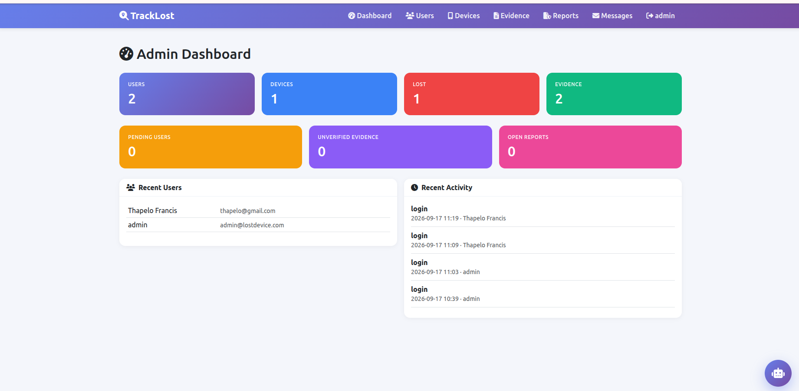
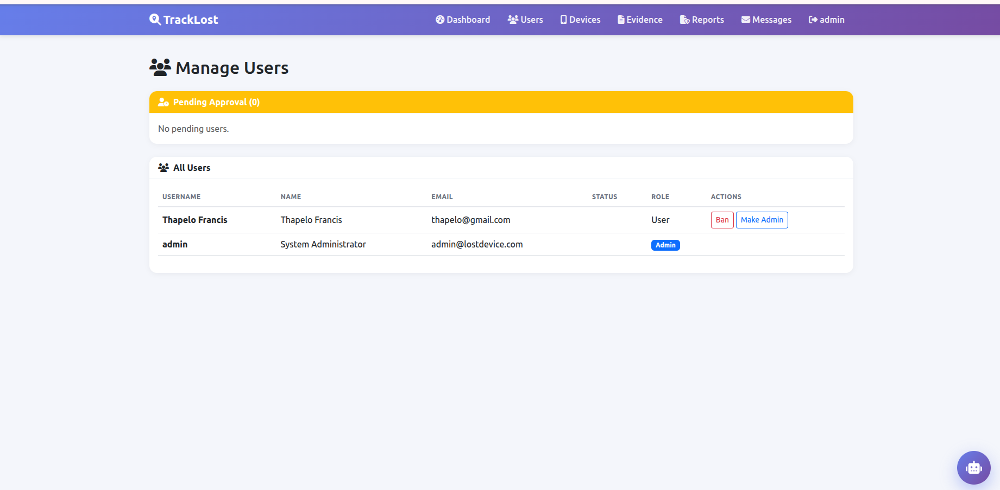
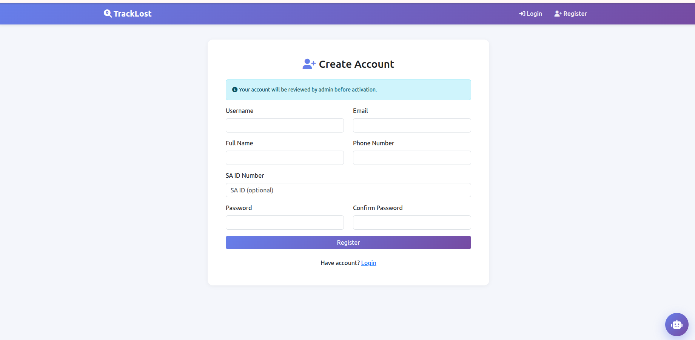
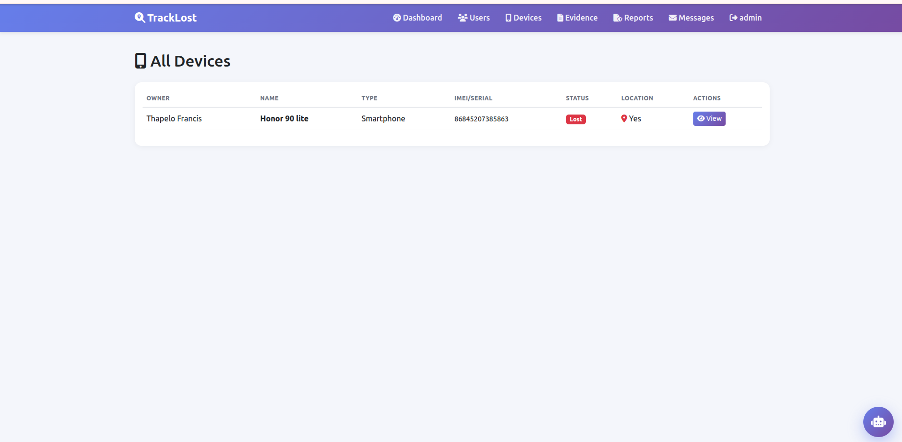
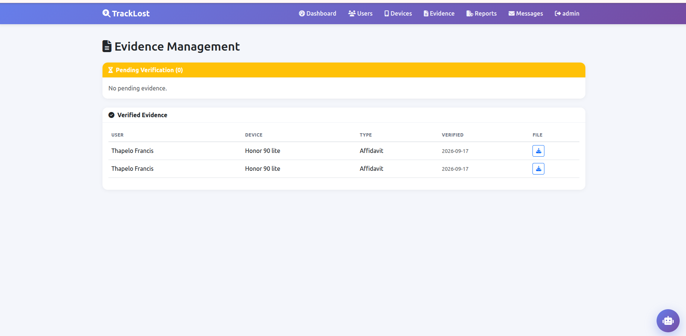
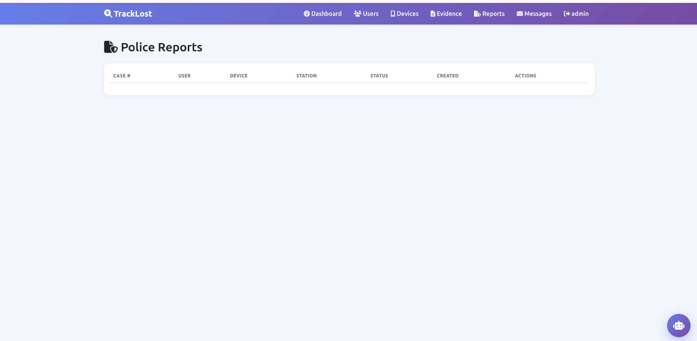
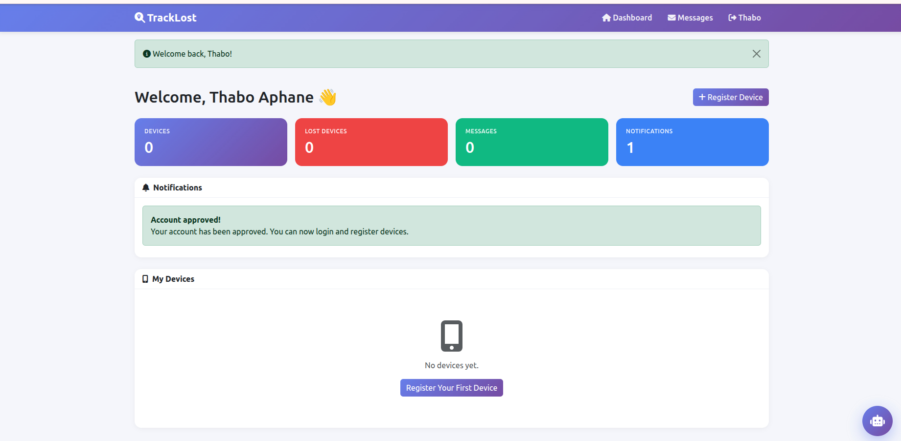
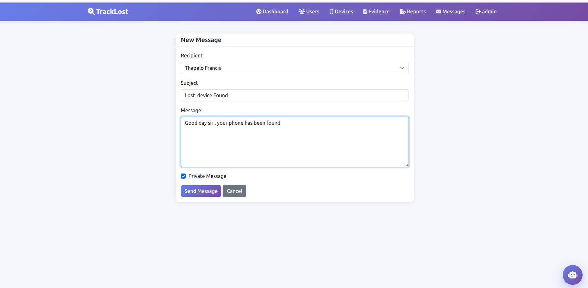
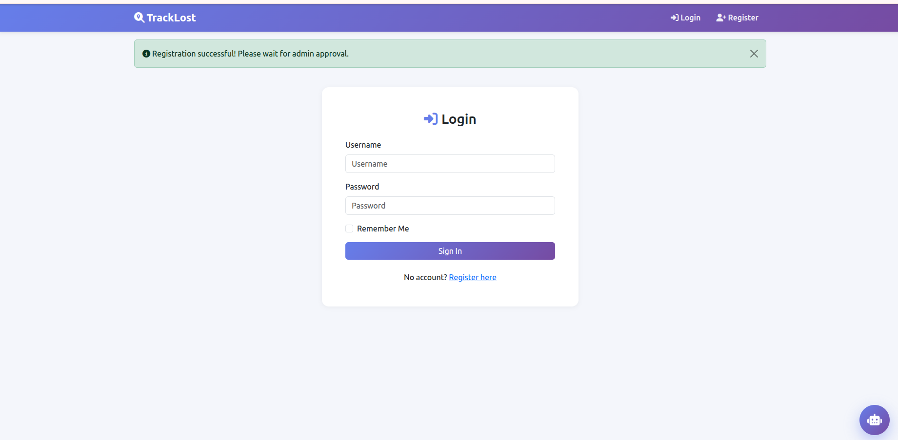

# 🔍 Lost Device Tracker

A full-stack web application that helps South Africans recover lost or stolen devices with police assistance.

**🌐 Live Demo:** [lost-device-tracker.onrender.com](https://lost-device-tracker.onrender.com)
**💻 GitHub:** [github.com/Thapelo-Makama/lost_device_tracker](https://github.com/Thapelo-Makama/lost_device_tracker)

---

## 📋 Overview

Every year, thousands of South Africans lose their phones and laptops. Proving ownership, tracking the device, and filing a police report are all difficult. This platform solves those problems in one place.

Users register devices with IMEI numbers, upload ownership evidence, share GPS locations, and file police reports. Admins verify evidence and assist with recovery.

---

## ✨ Features

- User registration with admin approval workflow
- Device registration (IMEI, serial, brand, model)
- Live GPS tracking with Leaflet.js maps
- Evidence upload (affidavits, receipts, photos)
- Admin verification of ownership
- Police report filing with case numbers
- Public and private messaging
- AI chatbot for platform help

---

## 🛠 Tech Stack

| Layer | Technology |
|-------|------------|
| Backend | Python 3, Flask, SQLAlchemy ORM |
| Database | MySQL (Aiven Cloud) |
| Auth | Flask-Login, Werkzeug hashing |
| Frontend | Jinja2, Bootstrap 5, vanilla JS |
| Maps | Leaflet.js + OpenStreetMap |
| AI | Keyword + fuzzy matching (difflib) |
| Hosting | Render + UptimeRobot |

---

## 📸 Screenshots

### Admin Dashboard — Real-time Stats

### Manage Users — Approve, Ban, Promote

### Pending User Approvals

### Device Management with IMEI Tracking

### Evidence Verification Workflow

### Police Reports

### User Dashboard

### Messages — Public and Private

### Login

---

## 🚀 Local Setup

    git clone https://github.com/Thapelo-Makama/lost_device_tracker.git
    cd lost_device_tracker
    python3 -m venv venv
    source venv/bin/activate
    pip install -r requirements.txt
    python init_db.py
    python run.py

Open http://localhost:5000

**Admin Login:** admin / Admin@2024!

---

## 🌍 Environment Variables

| Key | Description |
|-----|-------------|
| SECRET_KEY | Flask session key |
| DATABASE_URL | MySQL connection string |
| OPENAI_API_KEY | Optional AI responses |
| AI_MODEL | Default: gpt-3.5-turbo |

---

## 🔐 Security

- Passwords hashed with Werkzeug scrypt
- CSRF protection on all forms
- SQL injection prevention via SQLAlchemy ORM
- SSL-encrypted database connection
- Admin authorization decorators
- Secrets stored as environment variables

---

## 🎯 Future Improvements

- Automated tests with pytest
- Celery + Redis background jobs
- REST API for mobile app
- Email notifications
- 2FA authentication
- Rate limiting

---

## 📄 License

MIT © Thapelo Makama

---

## 👤 Author

**Thapelo Makama**
- Email: thapelofrancis266@gmail.com
- GitHub: [@Thapelo-Makama](https://github.com/Thapelo-Makama)

